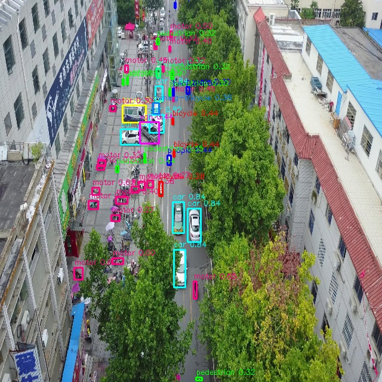

# VisDrone YOLO11s — AX650 目标检测模型

基于 YOLO11s 架构的航拍目标检测模型，在 [VisDrone2019-DET](https://hf-mirror.com/datasets/Voxel51/VisDrone2019-DET) 数据集上训练，编译为 AX650 AXMODEL。



## 模型信息
| 项目 | 值 |
|------|-----|
| 架构 | YOLO11s |
| 任务 | 目标检测 |
| 类别数 | 11 (含背景) |
| 类别 | pedestrian, people, bicycle, car, van, truck, tricycle, awning-tricycle, bus, motor |
| 输入 | 640×640 BGR, [0,255]→[0,1] float |
| 芯片 | AX650N (NPU3) |
| 量化 | U16 (Conv层) |
| AXMODEL | 10.6 MB |
| 推理延迟 | ~3.3 ms |

## 目录结构
```
models/          AXMODEL + model_meta.json
demo/            5张VisDrone测试图
python/          Python SDK (pydet绑定libdet.axera)
cpp/             C++ SDK (bin+lib+header)
  bin/           visdrone_detect (aarch64可执行)
  lib/           libdet.so (后处理+推理)
  include/       头文件
```

## 快速开始

### C++ (板上直接运行)
```bash
cd cpp
chmod +x bin/visdrone_detect
LD_LIBRARY_PATH=./lib:/soc/lib ./bin/visdrone_detect \
  ../models/model.axmodel ../demo/demo_00.jpg 0.25
```

### Python (板上)
```bash
cd python
pip install -r requirements.txt
python example.py --model ../models/model.axmodel --image ../demo/demo_00.jpg
```
Python SDK 依赖 `pyaxengine` 和板端 `libdet.so`。

## 精度

| 输出层 | Cosine Similarity | MSE |
|--------|-------------------|-----|
| output0 (80×80) | 0.99999 | 0.00531 |
| output1 (40×40) | 1.00000 | 0.00365 |
| output2 (20×20) | 0.99999 | 0.00371 |

## 预处理说明

输入 uint8 BGR [0,255] 通过 `std=1/255` 归一化到 float [0,1]，匹配 ONNX 浮点模型输入。

## 已知限制
- 输入分辨率固定: 640×640
- Batch size: 1
